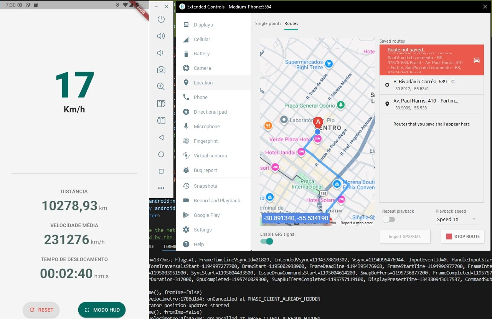

Mapa com Localização em Tempo Real (OpenStreetMap)
Um aplicativo Flutter que exibe a localização atual do usuário em um mapa interativo do OpenStreetMap, com atualização em tempo real e busca de endereços.

📸 Captura de Tela
(Sugestão: Tire uma nova captura de tela do aplicativo com a barra de busca e o mapa para colocar aqui)

✨ Funcionalidades
Mapa Interativo: Visualização da localização em um mapa dinâmico baseado no OpenStreetMap.

Localização em Tempo Real: O marcador do usuário se move no mapa conforme o dispositivo é deslocado.

Barra de Busca de Endereços: Permite que o usuário pesquise por um endereço e visualize sua localização no mapa.

Otimização de Bateria: A precisão do GPS é ajustada automaticamente com base no nível de bateria do dispositivo para um consumo mais eficiente de energia.

Ícone Personalizado: Substituição do ícone padrão do Flutter por um design exclusivo.

🛠️ Tecnologias Utilizadas
Flutter: Framework para desenvolvimento de aplicativos multiplataforma.

flutter_map: Biblioteca para a integração de mapas no Flutter.

geolocator: Para obter a localização do dispositivo via GPS.

geocoding: Para converter endereços em coordenadas geográficas (geocodificação).

provider: Para gerenciamento de estado.

battery_plus: Para monitorar o nível da bateria.

🚀 Como executar

Clone o repositório:

git clone https://github.com/seu-usuario/seu-repositorio.git
cd seu-repositorio

Instale as dependências:
flutter pub get

Execute o aplicativo:
flutter run

⚙️ Configuração de Permissões
Para que o aplicativo funcione corretamente, as seguintes permissões de localização devem ser concedidas pelo usuário e configuradas nos arquivos nativos:

Android (AndroidManifest.xml):

ACCESS_FINE_LOCATION

ACCESS_COARSE_LOCATION

iOS (Info.plist):

NSLocationWhenInUseUsageDescription

NSLocationAlwaysUsageDescription

NSLocationAlwaysAndWhenInUseUsageDescription

🤝 Como Contribuir
Contribuições são muito bem-vindas! Se você tem alguma ideia para melhorar o projeto, siga os passos:

Faça um Fork do projeto.

Crie uma nova branch (git checkout -b feature/sua-feature).

Faça o commit de suas alterações (git commit -m 'Adiciona sua-feature').

Faça o push para a branch (git push origin feature/sua-feature).

Abra um Pull Request.

👤 Autores

Bruno Andres

